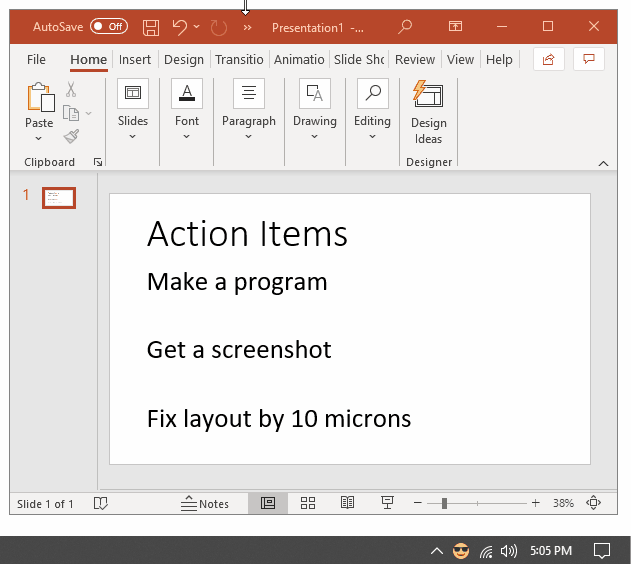

# Tmoji

**Tmoji is a Windows tray icon that makes it easy to copy emoji and special characters to the clipboard.** Many applications and websites _accept_ emoji as text input, but don't have an easy way to type them. Tmoji makes it easy to copy emoji to the clipboard so you can paste them anywhere text is accepted!

### Download from the [Tmoji website](https://swharden.com/software/Tmoji)