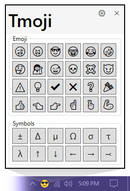
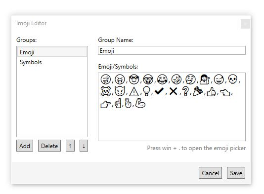

# Tmoji

**Tmoji is a Windows tray application that makes it easy to quickly copy emoji and special characters to the clipboard.** Many applications and websites _accept_ emoji as text input, but don't have an easy way to type them. Tmoji makes it easy to copy emoji to the clipboard so you can paste them anywhere text is accepted!

    <video loop="true" autoplay="autoplay" muted>
        <source src="tmoji-demo.mp4" type="video/mp4">
        Your browser does not support the video tag.
    </video>

### Launch Tmoji from the Tray

### Customize Emoji, Symbols, and Groups

### Download

TODO: download button goes here

Source code: https://github.com/swharden/Tmoji